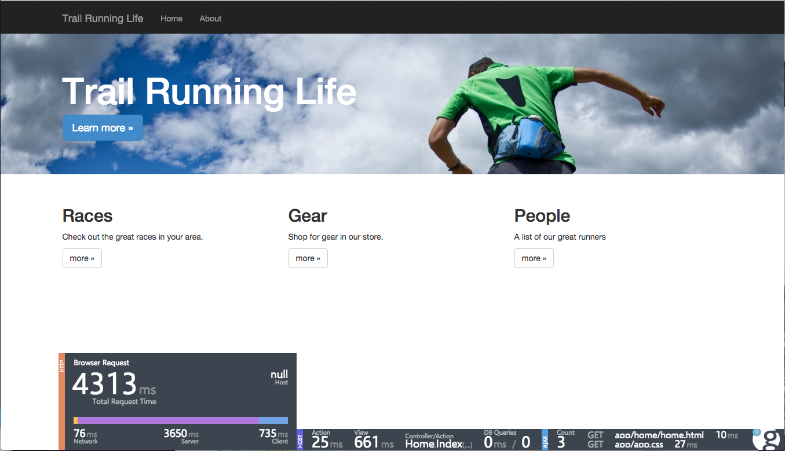

# CleanShave
An Angular 2 application with ASP.NET 5

### Getting Started
The application is built on rc1 of ASP.NET 5, refer to http://docs.asp.net to install.

1. Fork and clone the site

1. Run `npm install`

1. Run `dnu restore` to restore the .NET dependencies

1. Open Terminal window and execute `npm start`.  This command runs the `gulp build` task, then starts [nodemon](http://nodemon.io) for `dnx web`. The `nodemon` process will watch for any changes to the C# code and/or JavaScript files (transpiled from `tsc`) and restart then **kestrel** server.

1. Open http://localhost:5000

### Using Visal Studio 2015
To open in VS you need to open using the git connector.

Then open the `project.json` file. Be sure to have the **ASPNET 5** file/project type selected.

a `Before Build` step to have the gulp tasks run and build/compile the typescript and angular 2 project portions if you are just going to F5.

*** note that there is bug in the VS tooling for restoring the @reactivex/rxjs npm package use the command line tool and `npm install` to get the npm packages restored
